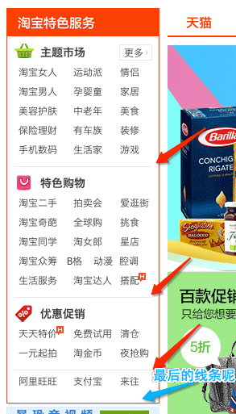
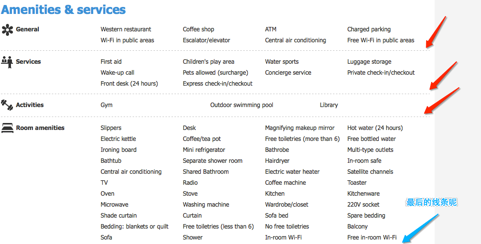

#消失的最后一条列表间隔线

一般在处理新闻标题列表或者排行榜之类的文本列表时，经常会看到设计稿上的设计风格是每行条目下面都会有一条虚线或者实线作为间隔，然后最后一条线是没有的。对于这样的列表内容，如果高度是固定不变的话，或许可以考虑用一个背景图来处理，但无论这个背景图是怎么样的，是否是用来平铺的还是一张大的图片，都不是我们所想要的，因为这个增加了一张图片，总感觉不爽，更何况本来就可以用`border-bottom:1px dashed #ccc`这样的边框来处理。

##示例图

来看几个在网上的随意截图，大概的意思就是这样的一个情况：

##代码

首先是一个列表的HTML代码：

	<ul>
		<li>这里是列表区域的文本内容 1</li>
		<li>这里是列表区域的文本内容 2</li>
		<li>这里是列表区域的文本内容 3</li>
		<li>这里是列表区域的文本内容 4</li>
		<li>这里是列表区域的文本内容 5</li>
	</ul>

然后就是各种方法中使用CSS的代码，分批来说明，或许有遗漏：

###增加className的方式：

这个方式就很简单了，直接在最后一个`li`上加一个**className**就搞定了。给了这个className后直接把`border-bottom:0 none`加上，就没边框了。

	.demo1 .last {border-bottom: 0 none;}

不过我不喜欢这样的方式，因为多了一个**className**，不知道程序中做循环输出的时候会不会很烦，个人觉得应该会，还要做一个判断，判定是最后一个`li`的时候，然后增加**className**，挺不爽的感觉。

###利用border-top和margin-top负值的方式

这个是我个人比较喜欢的一种方式之一，虽然在列表中看到的线条是在下面的，但又有谁知道到底是在`border-top`呢还是`border-bottom`，反正最终看到的效果都是一样的。

所以利用`border-top`的方式增加了边框后，再利用margin-top负值的方式拉上去，加上`ul`里有`overflow`，那么出去的边框不就看不到了么，所以，效果也有了啊。

	.demo2 ul {overflow: hidden;}
	.demo2 li {height: 31px;margin-top: -1px;border-top: 1px dashed #aaa;}
	
不过同时还需要注意的就是，因为`margin-top:-1px;`了，所以，还是需要把`li`的高度相对增加`1px`才算是需要的高度。

###利用li标签的margin-bottom负值

这个方式跟上面那个`border-top`是异曲同工的感觉，只是上下不同了而已，最终效果是一样的。不过需要注意的是，好像这个方法可以不用给`ul`增加`overflow:hidden;`哦。不增加`overflow`的话，那么如果这个列表中有元素需要定位到列表外面就不会被隐藏了。

所以，这个方法也是我个人比较喜欢的方法之一。

	.demo3 li {height: 31px;margin-bottom: -1px;border-bottom: 1px dashed #aaa;}
	
###利用:last-child的选择符

这个方法，大家一看就知道啦，是用`:last-child`这个伪元素选择符来对列表的最后一个做了选择，然后进行边框样式重新定义。那么当然也是可以用`:first-child`的方式来选择第一个元素的边框样式定义，如果你的边框是用`border-top`来定义的话。

	.demo4 li {border-bottom: 1px dashed #aaa;}
	.demo4 li:last-child {border-bottom: 0 none;}
	
###demo示例

以上四个的demo在这里，请 [>>点击<<](http://linxz.github.io/CSS_Skills/demo/text/hidden_list_last_border.html)

##小结一下
目前想到的方法就是这些了，然后其他的方式大部分来说都是差不多的。基本上我个人的感觉就是这么几点：

* 利用**className**来单独处理；
* 利用CSS3的选择符方式来处理；
* 利用`margin`负值的方式让边框跑出`ul`列表之外，然后隐藏；

其实吧，如果周围还有其他元素，还可以借其他元素的背景或者边框来叠加在这个列表上面，总之就是只有一点，**不让用户看到这个边框，那就是没有边框了**。

