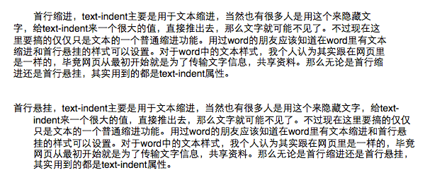
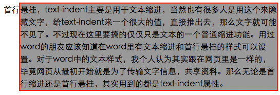
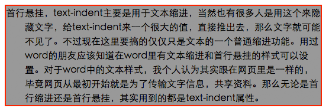

#首行缩进&首行悬挂
在段落文本中，尤其是在word里面的操作，一般我们都会用首行缩进的功能，而且一般缩进都是2个字符。对于这样的一个段落样式来说，在word里面很容易就可以实现了。

而对于网页来说，其实样式的表现跟word里是一样的，只不过我们在网页里面是用CSS属性来实现。大家也肯定都知道在CSS中用`text-indent`这个属性就能轻松搞定首行缩进。

比如：

	p {text-indent: 2em;}
	
对于这个，大家肯定都知道是让`p`标签中的首行缩进**两个字符**，因为使用了`em`作为单位。

从这个CSS属性中我们可以理解，如果当`text-indent`的属性值为负值的时候，不就是可以向左边（*按照国内正常的从左到右的阅读习惯*）拉出去了吗？的确，我们可以很直接地给一个负值就能完成了，就比如这样：

	p {text-indent: -2em;}
	
很简单，也很轻松就实现了首行缩进和首行悬挂的样式。就跟在word中一样，这里截了个图，是pages里的，机子里木有word～

##网页效果
在看网页中的效果，其实跟这个是一样的，直接给demo地址吧。

[首行缩进和首行悬挂的demo](../demo/text/text-indent.html)

很简单，关键代码如下：

	
	
	
首行缩进，text-indent主要是用于文本缩进，当然也有很多人是用这个来隐藏文字，给text-indent来一个很大的值，直接推出去，那么文字就可能不见了。不过现在这里要搞的仅仅只是文本的一个普通缩进功能。用过word的朋友应该知道在word里有文本缩进和首行悬挂的样式可以设置。对于word中的文本样式，我个人认为其实跟在网页里是一样的，毕竟网页从最初开始就是为了传输文字信息，共享资料。那么无论是首行缩进还是首行悬挂，其实用到的都是text-indent属性。

	
首行悬挂，text-indent主要是用于文本缩进，当然也有很多人是用这个来隐藏文字，给text-indent来一个很大的值，直接推出去，那么文字就可能不见了。不过现在这里要搞的仅仅只是文本的一个普通缩进功能。用过word的朋友应该知道在word里有文本缩进和首行悬挂的样式可以设置。对于word中的文本样式，我个人认为其实跟在网页里是一样的，毕竟网页从最初开始就是为了传输文字信息，共享资料。那么无论是首行缩进还是首行悬挂，其实用到的都是text-indent属性。

###代码简要说明
在这里，我给首行悬挂的样式多增加了一个`padding-left:2em;`，这个的主要作用是让整个文本也有所缩进。

这里用`padding-left`的方式来缩进而不用`margin-left`的方式来缩进的主要原因是`background`和`border`。直接看图来说明，当使用`margin-left`后，如果有`background`或者`border`时的情况：

很清晰的看到，悬挂的两个字符跑到外面去了，所以这里才考虑使用`padding-left`来使整体缩进。

##其他想说的
曾经我问过一些朋友，像word里一样，做一个首行悬挂的段落样式要怎么做，当时他们很多人想到的是用`:first-line`这样的方式来操作，然后折腾了好久。最后的情况我忘了，印象比较深的也就是`:first-line`了。

然后也有人，可不可以在第一行增加一个标签来控制呢。其实当然是可以啊，不过这样的话，肯定是必须要知道第一行有多少个字符才行啊。但这样真的好吗？

我个人的想法是，很多人估计觉得`text-indent`就只有正的值，而不会有负的值，所以才没想到的，因为他们都知道首行缩进怎么处理。
